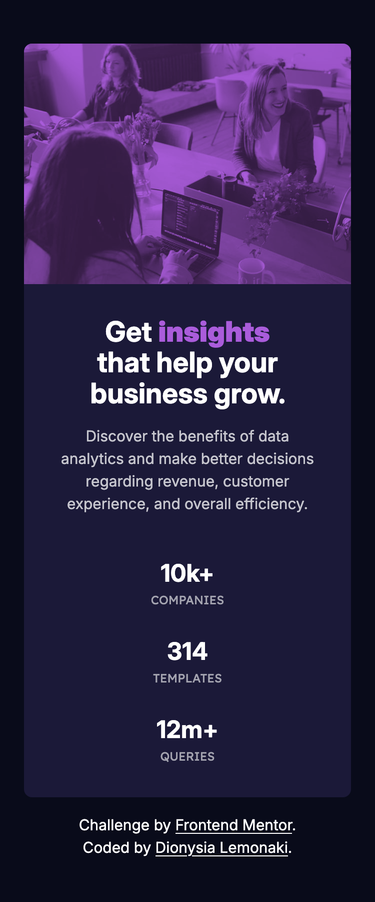
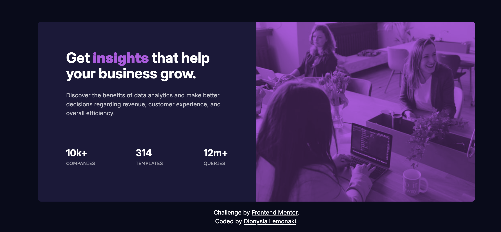

# Frontend Mentor - Stats preview card component solution

This is a solution to the [Stats preview card component challenge on Frontend Mentor](https://www.frontendmentor.io/challenges/stats-preview-card-component-8JqbgoU62). 

## Table of contents

- [Overview](#overview)
  - [The challenge](#the-challenge)
  - [Screenshot](#screenshot)
  - [Links](#links)
- [My process](#my-process)
  - [Built with](#built-with)
  - [What I learned](#what-i-learned)
- [Author](#author)

## Overview

### The challenge

Users should be able to:

- View the optimal layout depending on their device's screen size

### Screenshot

Mobile view:

Desktop view:

### Links

- [Solution URL](https://www.frontendmentor.io/solutions/responsive-stats-preview-card-component-using-flexbox-and-grid-87k0DLybki)
- [Live site URL](https://fem-stats-preview-card-component-peach.vercel.app/)

## My process

### Built with

- Semantic HTML5 markup
- CSS custom properties
- Flexbox
- CSS Grid
- Mobile-first workflow

### What I learned

I learnt how to use blend modes on images thanks to a tip I saw while searching through Frontend Mentor's Discord.

For the image, I used the `picture` element in the HTML. 

To achieve the colour effect, I set a background colour on the `picture` element in the CSS and applied `mix-blend-mode: multiply` along with `opacity` on the `img` element. 

This method was much more simple and straighforward than using an absolutely positioned overlay.

## Author

- [Frontend Mentor Profile](https://www.frontendmentor.io/profile/dionysia-lemonaki)
- [LinkedIn profile](https://www.linkedin.com/in/dionysia-lemonaki-developer/)

